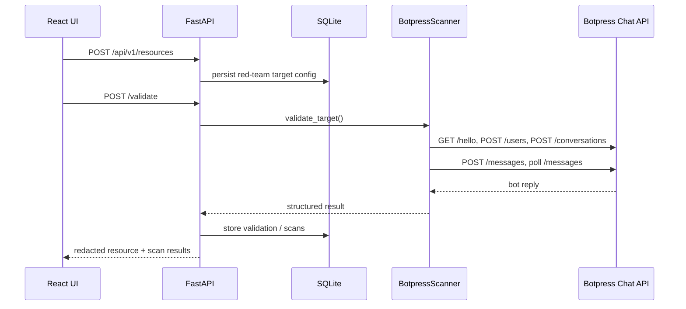

# Design Document

## Problem statement

An AI security platform needs connectors for SaaS agent platforms so it can discover and test customer bots without requiring product-code access. The connector turns a platform-specific chat API into a consistent scanner interface: onboard a resource, validate it, send adversarial prompts, collect replies, and return structured metadata for risk analysis.

## Architecture

The backend owns Botpress credentials and request orchestration. The frontend only receives redacted metadata.

## Onboarding model

Required fields:

- `account_name`: logical customer or account group.
- `resource_name`: human label for this Botpress bot.
- `webhook_id`: Botpress Chat integration webhook ID.

Optional fields:

- `encryption_key`: manual authentication signing key.
- `user_id`: manual authentication subject.
- `description`: context shown in UI and reports.

Validation rejects arbitrary URLs. The connector accepts only a webhook ID and appends it to the configured Botpress Chat API base URL. This reduces SSRF risk compared with letting users submit a free-form target URL.

Secrets are stored locally in SQLite for the demo and redacted in every API response. A production version should encrypt secrets with KMS or a secrets manager and avoid returning them after creation.

## Botpress integration deep-dive

The Botpress Chat API flow is:

1. `GET /{webhook_id}/hello` for reachability.
2. `POST /{webhook_id}/users` to create a chat user and receive `x-user-key`.
3. `POST /{webhook_id}/conversations` with `x-user-key`.
4. `POST /{webhook_id}/messages` with a text payload.
5. `GET /{webhook_id}/conversations/{conversation_id}/messages` until a bot reply appears.

This implementation uses polling. SSE is lower latency, but polling is deterministic, easy to mock, and sufficient for an 8-hour connector exercise. The connector interface keeps `delivery_mode` in metadata so SSE can be added later without changing API consumers.

Manual authentication is supported when both `encryption_key` and `user_id` are supplied. The connector signs an HS256 JWT for `x-user-key` and skips automatic `POST /users`.

## Session / conversation strategy

The scanner creates one user key per scanner instance and one conversation at a time. The API uses `reset_conversation=true` by default for scans, so each scan run starts from a clean conversation and reduces prompt bleed between attacks. Within a multi-prompt scan, the current implementation resets before the first prompt and reuses the conversation for the rest of that request. A production scheduler could expose per-prompt isolation as a policy option.

Validation is idempotent: repeated calls create short-lived conversations and do not mutate user-facing configuration except validation status.

## Error handling matrix

| Botpress condition | User-visible message |
| --- | --- |
| Timeout | Botpress request timed out or bot reply timed out |
| 401 / 403 | Botpress rejected the credentials or user key |
| 404 | Botpress webhook or conversation was not found |
| 429 | Botpress rate limit reached. Wait and retry |
| 5xx | Botpress service returned an upstream error |
| Invalid JSON | Botpress returned an invalid JSON response |

Errors are sanitized before returning to UI callers. Stack traces and user keys are not returned.

## Security

The connector never accepts an arbitrary target URL from the UI. It accepts `webhook_id` and combines it with `BOTPRESS_CHAT_BASE_URL`.

Secrets are not logged by application code and are redacted from API responses. The demo stores optional encryption keys in SQLite because local persistence is part of the assignment. Production should use encrypted columns or a managed secret store.

Rate limiting is mapped to a safe error. Production should add per-resource concurrency controls, audit logs, and tenant-level quotas to avoid exhausting Botpress free-tier or customer quotas.

## Observability

Production telemetry should include structured logs and metrics:

- validation attempt count and status
- scan count by resource and vulnerability type
- Botpress latency histogram
- timeout count
- upstream status code count
- delivery mode
- redacted webhook ID prefix/suffix

Logs should include correlation IDs for scan runs and omit webhook secrets, encryption keys, and user keys.

## Testing strategy

Unit tests cover scanner orchestration, success and failure validation, timeout handling, conversation reset, secret sanitization, and text extraction.

Integration tests run against a local FastAPI mock Botpress server. The mock implements hello, user creation, conversation creation, message creation, delayed bot replies through polling, and a 429 rate-limit path. No test requires a real Botpress webhook.

Live smoke testing is manual and documented in `README.md` to avoid burning free-tier quota in CI.

## Future Improvements & Production Hardening

Production work would include:

- encrypted secret storage
- tenant-aware authorization
- per-tenant rate limits
- background scan workers for long-running tests
- SSE support with polling fallback
- richer payload extraction for cards, carousels, images, and files
- migrations instead of direct `create table if not exists`
- rollout flags by connector version
- backward-compatible scan result schemas

## Known limitations

- Polling has higher latency than SSE.
- Rich Botpress messages are only partially converted to text.
- SQLite is suitable for the demo, not multi-instance production hosting.
- The UI is single-user and intentionally unauthenticated.
- Validation sends a lightweight `ping`, which consumes a small amount of Botpress quota.

